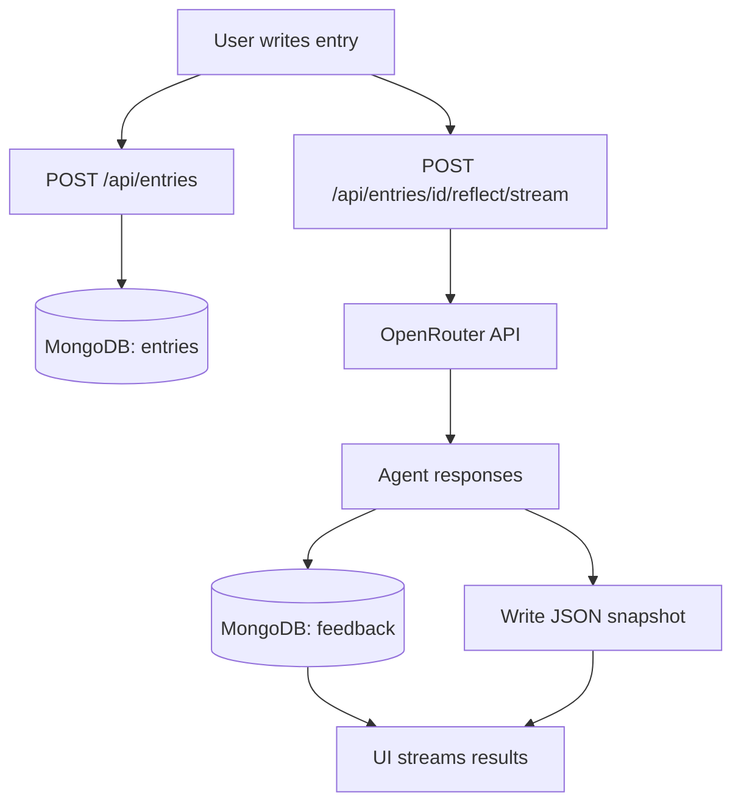

# AI Private Blogging Feedback

A private writing workspace that turns raw thoughts into clearer thinking through three fixed AI roles: Editor (clarity), Skeptic (logic), and Coach (direction). The system is intentionally non-social and non-gamified. It is designed to improve reasoning, not boost mood.

## What This Is
- Private thinking space
- Multi-agent reflection mirror
- Clarity and pressure over comfort

## What This Is Not
- Social platform
- Journaling streak app
- Productivity tool
- Public blog

## Core Flow
1. Write an entry (title optional).
2. Save the entry.
3. Reflect to receive three independent responses.
4. Re-read and decide your next step.

## Features
- Three fixed agents with distinct roles
- Read-only reflection output (no chat UI)
- Entry history with quick retrieval
- Streaming reflections (agent-by-agent)
- JSON snapshots saved per entry

## Tech Stack
- Next.js (App Router)
- React
- TypeScript
- Tailwind CSS
- MongoDB
- OpenRouter API

## Project Structure
```
apps/web/
├── app/
│   ├── api/
│   │   └── entries/               # API routes
│   ├── layout.tsx
│   ├── page.tsx                   # UI
│   └── globals.css
├── lib/
│   ├── mongodb.ts                 # MongoDB client
│   ├── openrouter.ts              # OpenRouter client
│   ├── prompts.ts                 # Agent prompts
│   └── reflection-store.ts        # JSON snapshots
└── reflections/                   # Saved reflection JSON files
```

## Data Model (MongoDB)

### entries
```json
{
  "_id": "ObjectId",
  "title": "string | null",
  "body": "string",
  "createdAt": "Date",
  "updatedAt": "Date",
  "status": "draft | reflected",
  "wordCount": "number"
}
```

### feedback
```json
{
  "_id": "ObjectId",
  "entryId": "ObjectId",
  "agent": "editor | skeptic | coach",
  "content": "string",
  "createdAt": "Date",
  "model": "string",
  "promptVersion": "string"
}
```

## API Endpoints
- `GET /api/entries` - list recent entries
- `POST /api/entries` - create entry
- `GET /api/entries/[id]` - fetch entry + feedback
- `PATCH /api/entries/[id]` - update entry (clears old feedback)
- `DELETE /api/entries/[id]` - delete entry + feedback
- `POST /api/entries/[id]/reflect` - reflect (non-streaming)
- `POST /api/entries/[id]/reflect/stream` - reflect (streaming)

## Reflection Snapshots
After reflection, a JSON snapshot is written to `apps/web/reflections/<entryId>.json`.
This includes the entry content and all agent feedback for auditability and local backup.

## Setup

### 1) Install dependencies
```bash
cd apps/web
npm install
```

### 2) Configure environment variables
Create `apps/web/.env.local`:
```
MONGODB_URI=your_mongodb_connection_string
MONGODB_DB=ai_private_blog
OPENROUTER_API_KEY=your_openrouter_api_key
OPENROUTER_MODEL=openai/gpt-4o-mini
OPENROUTER_APP_URL=http://localhost:3000
OPENROUTER_APP_NAME=AI Private Blogging Feedback
```

### 3) Run the app
```bash
npm run dev
```

Open `http://localhost:3000`.

## How Reflections Work
- The same entry is sent to three agents with different prompts.
- Responses are generated independently.
- Results are saved to MongoDB and also written to a JSON snapshot.
- The UI streams agent results as they arrive.

## Troubleshooting
- **Reflection fails immediately**: verify `OPENROUTER_API_KEY` and `OPENROUTER_MODEL`.
- **Entry load fails**: verify `MONGODB_URI` and `MONGODB_DB` and that the DB is reachable.
- **No streaming output**: check the dev server console for errors; streaming uses `reflect/stream`.

## Architecture Diagram



## License
MIT
