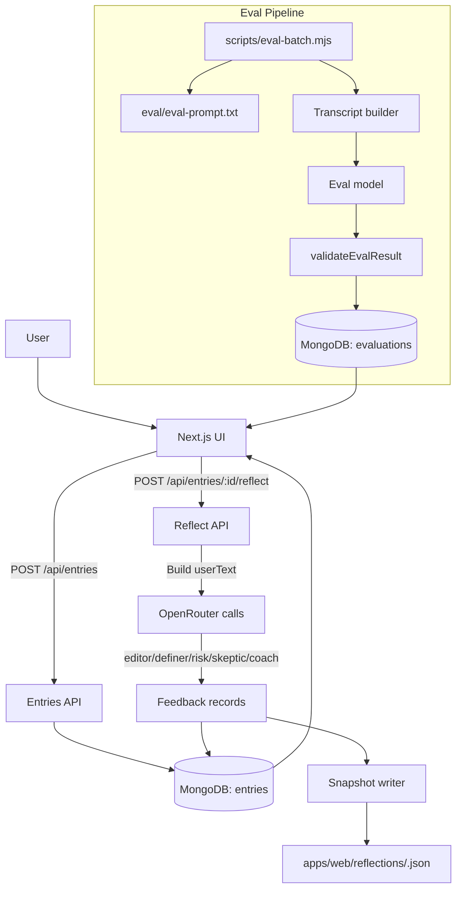

# Private Blogging Intelligence

Private writing workspace that produces structured, multi-agent reflection and evaluation. The system is intentionally non-social and focused on clarity, accountability, and auditability.

## Overview
- Five fixed agents: Editor, Definer, Risk, Skeptic, Coach.
- Read-only reflection outputs (no conversational UI).
- Streaming or non-streaming reflection.
- JSON snapshots for audits and local backup.
- Evaluation pipeline for format and role compliance.

## Core Workflow
1. User writes an entry and saves it.
2. The entry is stored in MongoDB.
3. User triggers reflection.
4. The API calls each agent with shared rules and agent-specific prompts.
5. Feedback is stored in MongoDB and a snapshot is written to `apps/web/reflections/<entryId>.json`.
6. Optional: run eval scripts to validate outputs and store evaluation results.

## Architecture Diagram


## Tech Stack
- Next.js (App Router)
- React + TypeScript
- Tailwind CSS
- MongoDB
- OpenRouter API

## Project Structure
```
apps/web/
├── app/                     # UI and API routes
├── lib/                     # MongoDB, OpenRouter, prompts, eval utils
├── reflections/             # Snapshot JSON files
├── eval/                    # Eval prompt and golden cases
└── scripts/                 # Eval scripts
```

## Configuration
Create `apps/web/.env.local`:
```
MONGODB_URI=your_mongodb_connection_string
MONGODB_DB=ai_private_blog
OPENROUTER_API_KEY=your_openrouter_api_key
OPENROUTER_MODEL=your_default_model

# Optional per-agent overrides
OPENROUTER_MODEL_EDITOR=...
OPENROUTER_MODEL_DEFINER=...
OPENROUTER_MODEL_RISK=...
OPENROUTER_MODEL_SKEPTIC=...
OPENROUTER_MODEL_COACH=...

# Optional per-agent max tokens
OPENROUTER_MAX_TOKENS=...
OPENROUTER_MAX_TOKENS_EDITOR=...
OPENROUTER_MAX_TOKENS_DEFINER=...
OPENROUTER_MAX_TOKENS_RISK=...
OPENROUTER_MAX_TOKENS_SKEPTIC=...
OPENROUTER_MAX_TOKENS_COACH=...

OPENROUTER_EVAL_MODEL=your_eval_model
OPENROUTER_EVAL_MAX_TOKENS=1500
OPENROUTER_APP_URL=http://localhost:3000
OPENROUTER_APP_NAME=Private Blogging Intelligence
```

## Commands
Run from `apps/web`:
- `npm run dev`
- `npm run build`
- `npm run start`
- `npm run lint`
- `npm run eval:pr`
- `npm run eval:gate`

## API Endpoints
- `GET /api/entries`
- `POST /api/entries`
- `GET /api/entries/:id`
- `PATCH /api/entries/:id`
- `DELETE /api/entries/:id`
- `POST /api/entries/:id/reflect`
- `POST /api/entries/:id/reflect/stream`

## Where Things Live
- Prompts: `apps/web/lib/prompts.ts`
- Model config: `apps/web/lib/model-config.ts`
- Reflect routes: `apps/web/app/api/entries/[id]/reflect`
- Eval prompt: `apps/web/eval/eval-prompt.txt`
- Eval utils: `apps/web/lib/eval-utils.ts` and `.mjs`
- Eval dashboard: `apps/web/app/admin/eval`

## Evaluation Pipeline
- Build transcript from entry + feedback.
- Eval model produces a JSON verdict.
- Validation enforces evidence must exist in the transcript.
- Results are stored in `evaluations` and visualized in the admin dashboard.

## Sync Checklist (When Changing Agents)
- `apps/web/lib/prompts.ts`
- Reflect routes agent list
- `apps/web/lib/model-config.ts`
- `apps/web/eval/eval-prompt.txt`
- `apps/web/lib/eval-utils.ts` and `.mjs`
- UI agent labels/order (`apps/web/app/page.tsx`)
- Eval dashboard ordering (`apps/web/app/admin/eval`)
