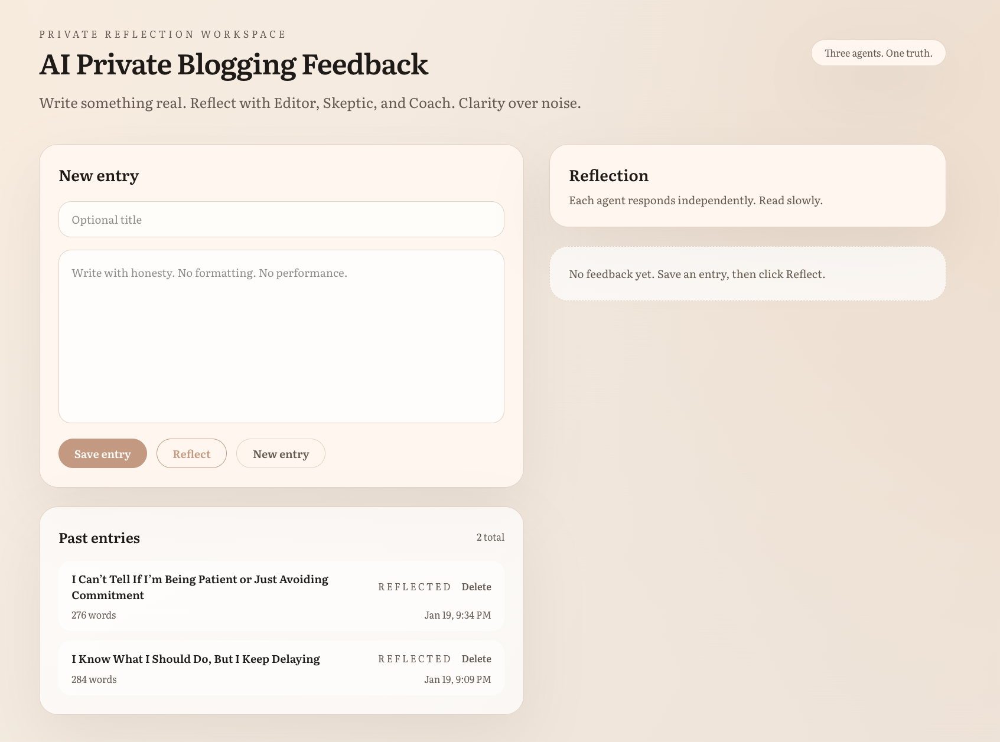
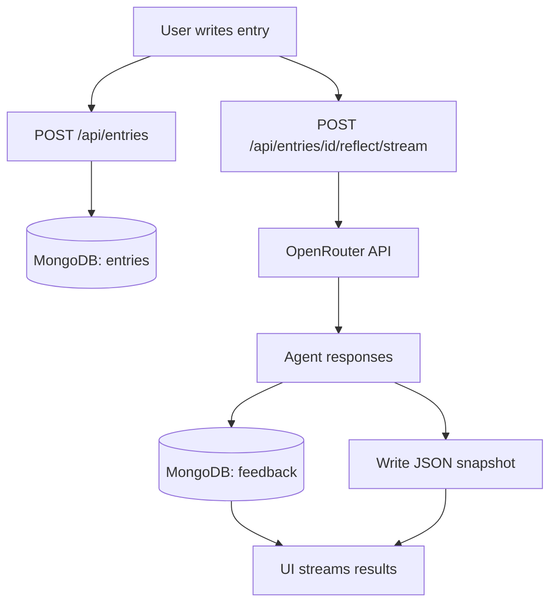

# AI Private Blogging Feedback

A private writing workspace that uses three fixed AI agents to improve thinking clarity. Write entries, receive independent feedback from Editor (clarity), Skeptic (logic), and Coach (direction). Non-social, non-gamified, focused on reasoning over comfort.

---

## Quick Start

```bash
cd apps/web
npm install
```

Create `apps/web/.env.local`:
```env
MONGODB_URI=your_mongodb_connection_string
MONGODB_DB=ai_private_blog
OPENROUTER_API_KEY=your_openrouter_api_key
OPENROUTER_MODEL=xiaomi/mimo-v2-flash:free
OPENROUTER_APP_URL=http://localhost:3000
OPENROUTER_APP_NAME=AI Private Blogging Feedback
```

```bash
npm run dev
```

Open `http://localhost:3000`.

---

## How It Works

1. Write an entry (title optional)
2. Save to MongoDB
3. Click Reflect to generate three agent responses
4. Review feedback (streamed agent-by-agent)



### Agent Roles

| Agent | Output Format | Purpose |
|-------|---------------|---------|
| **Editor** | SUMMARY, FIXES, REWRITE | Improves clarity and structure without changing meaning |
| **Skeptic** | CORE CLAIM, CHALLENGES, TEST | Stress-tests thinking with 3 pointed challenges |
| **Coach** | INTENT, OPTIONS, RECOMMENDATION | Makes trade-offs explicit, forces narrowing |

---

## Features

- **Three independent agents** - Each uses distinct prompts, no cross-agent communication
- **Streaming responses** - Results appear agent-by-agent via `/reflect/stream` endpoint
- **JSON snapshots** - Each reflection saved to `apps/web/reflections/<entryId>.json`
- **Entry management** - Create, update, delete entries; updating clears old feedback
- **Read-only UI** - No chat interface; feedback is displayed, not conversational

---

## Tech Stack

- Next.js 16 (App Router)
- React 19, TypeScript
- Tailwind CSS
- MongoDB
- OpenRouter API

---

## Project Structure

```
apps/web/
├── app/
│   ├── api/entries/          # REST API routes
│   ├── page.tsx              # Main UI component
│   └── layout.tsx            # Root layout
├── lib/
│   ├── mongodb.ts            # MongoDB connection
│   ├── openrouter.ts         # OpenRouter API client
│   ├── prompts.ts            # Agent prompt definitions
│   └── reflection-store.ts   # JSON snapshot writer
└── reflections/              # Generated JSON snapshots
```

---

## API Endpoints

**Entries**
- `GET /api/entries` - Returns array of recent entries
- `POST /api/entries` - Creates entry, returns `{ entry: Entry }`
- `GET /api/entries/[id]` - Returns `{ entry: Entry, feedback: Feedback[] }`
- `PATCH /api/entries/[id]` - Updates entry, clears old feedback
- `DELETE /api/entries/[id]` - Deletes entry and all feedback

**Reflection**
- `POST /api/entries/[id]/reflect` - Synchronous reflection, returns all feedback
- `POST /api/entries/[id]/reflect/stream` - Streams feedback as it arrives (SSE)

---

## Data Model

**Entry**
```typescript
{
  _id: ObjectId
  title: string | null
  body: string
  createdAt: Date
  updatedAt: Date
  status: "draft" | "reflected"
  wordCount: number
}
```

**Feedback**
```typescript
{
  _id: ObjectId
  entryId: ObjectId
  agent: "editor" | "skeptic" | "coach"
  content: string
  createdAt: Date
  model: string
  promptVersion: string
}
```

---

## Reflection Process

1. Entry text sent to three agents simultaneously via OpenRouter API
2. Each agent uses distinct prompt from `lib/prompts.ts`
3. Responses generated independently (parallel, no communication)
4. Results saved to MongoDB `feedback` collection
5. JSON snapshot written to `apps/web/reflections/<entryId>.json`
6. UI streams results via Server-Sent Events

---

## Architecture



---

## Troubleshooting

| Issue | Solution |
|-------|----------|
| Reflection fails immediately | Check `OPENROUTER_API_KEY` and `OPENROUTER_MODEL` in `.env.local` |
| Entry load fails | Verify `MONGODB_URI` and `MONGODB_DB`, test MongoDB connection |
| No streaming output | Check browser console and dev server logs; ensure using `/reflect/stream` endpoint |
| Build fails | Verify all environment variables are set; check TypeScript errors |

---

## Reflection Snapshots

After reflection completes, a JSON file is written to `apps/web/reflections/<entryId>.json` containing:

- Complete entry content (title, body, metadata)
- All three agent feedback responses
- Timestamps, model name, prompt version

Use for local backup, auditability, or offline analysis.

---

## License

MIT License

Copyright (c) 2024 Haseeb Raza

Permission is hereby granted, free of charge, to any person obtaining a copy
of this software and associated documentation files (the "Software"), to deal
in the Software without restriction, including without limitation the rights
to use, copy, modify, merge, publish, distribute, sublicense, and/or sell
copies of the Software, and to permit persons to whom the Software is
furnished to do so, subject to the following conditions:

The above copyright notice and this permission notice shall be included in all
copies or substantial portions of the Software.

THE SOFTWARE IS PROVIDED "AS IS", WITHOUT WARRANTY OF ANY KIND, EXPRESS OR
IMPLIED, INCLUDING BUT NOT LIMITED TO THE WARRANTIES OF MERCHANTABILITY,
FITNESS FOR A PARTICULAR PURPOSE AND NONINFRINGEMENT. IN NO EVENT SHALL THE
AUTHORS OR COPYRIGHT HOLDERS BE LIABLE FOR ANY CLAIM, DAMAGES OR OTHER
LIABILITY, WHETHER IN AN ACTION OF CONTRACT, TORT OR OTHERWISE, ARISING FROM,
OUT OF OR IN CONNECTION WITH THE SOFTWARE OR THE USE OR OTHER DEALINGS IN THE
SOFTWARE.
