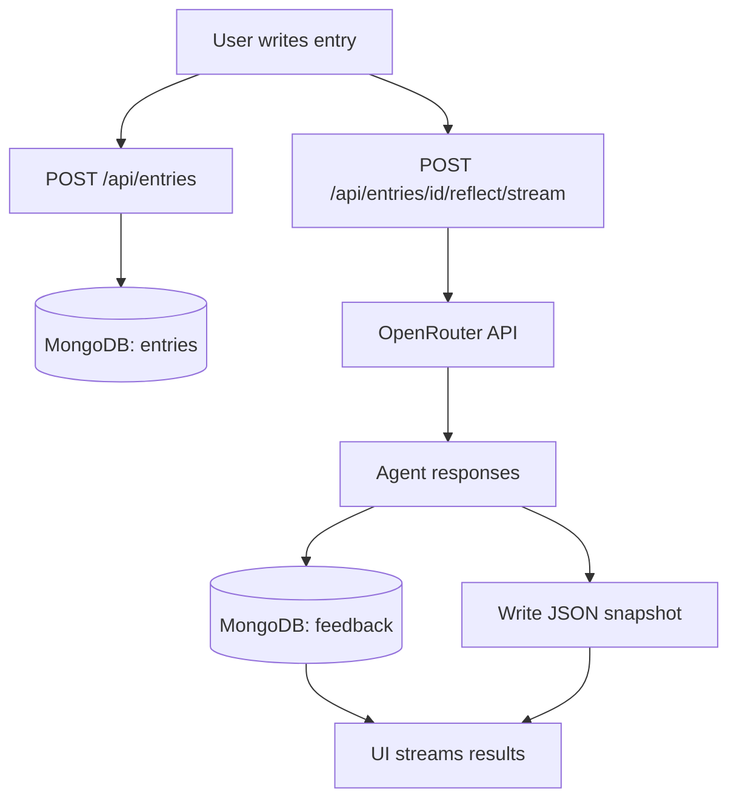

# AI Private Blogging Feedback

> A private writing workspace that turns raw thoughts into clearer thinking through three fixed AI roles: Editor (clarity), Skeptic (logic), and Coach (direction). The system is intentionally non-social and non-gamified. It is designed to improve reasoning, not boost mood.

---

## Quick Start

```bash
cd apps/web
npm install
cp .env.example .env.local  # Configure your environment variables
npm run dev
```

Open `http://localhost:3000` to start writing.

---

## Overview

### What This Is
- **Private thinking space** - Your entries stay local and private
- **Multi-agent reflection** - Three independent AI perspectives on your writing
- **Clarity-focused** - Designed to improve reasoning, not provide comfort

### What This Is Not
- Social platform or public blog
- Journaling streak tracker
- Productivity gamification tool
- Chat interface or conversation system

---

## How It Works

1. **Write** an entry (title optional)
2. **Save** the entry to your local database
3. **Reflect** to receive three independent agent responses
4. **Review** and decide your next step

### The Three Agents

| Agent | Role | Purpose |
|-------|------|---------|
| **Editor** | Clarity | Improves structure and clarity without changing meaning |
| **Skeptic** | Logic | Stress-tests your thinking with pointed challenges |
| **Coach** | Direction | Helps you choose direction by making trade-offs explicit |

---

## Features

- Three fixed agents with distinct, non-overlapping roles
- Read-only reflection output (no chat UI)
- Entry history with quick retrieval
- Streaming reflections (agent-by-agent)
- JSON snapshots saved per entry for auditability
- Private by design (no social features)

---

## Tech Stack

- **Framework**: Next.js 16 (App Router)
- **UI**: React 19, TypeScript, Tailwind CSS
- **Database**: MongoDB
- **AI**: OpenRouter API

---

## Setup

### Prerequisites

- Node.js 18+ 
- MongoDB database (local or Atlas)
- OpenRouter API key

### Installation

1. **Clone and install**
   ```bash
   git clone https://github.com/haseebraza715/forkpoint-.git
   cd forkpoint-/apps/web
   npm install
   ```

2. **Configure environment**
   
   Create `apps/web/.env.local`:
   ```env
   MONGODB_URI=your_mongodb_connection_string
   MONGODB_DB=ai_private_blog
   OPENROUTER_API_KEY=your_openrouter_api_key
   OPENROUTER_MODEL=xiaomi/mimo-v2-flash:free
   OPENROUTER_APP_URL=http://localhost:3000
   OPENROUTER_APP_NAME=AI Private Blogging Feedback
   ```

3. **Run the app**
   ```bash
   npm run dev
   ```

---

## Project Structure

```
apps/web/
├── app/
│   ├── api/
│   │   └── entries/               # API routes
│   ├── layout.tsx                 # Root layout
│   ├── page.tsx                   # Main UI
│   └── globals.css                # Global styles
├── lib/
│   ├── mongodb.ts                 # MongoDB client
│   ├── openrouter.ts              # OpenRouter API client
│   ├── prompts.ts                 # Agent prompts
│   └── reflection-store.ts        # JSON snapshot writer
└── reflections/                   # Saved reflection JSON files
```

---

## API Reference

### Entries

- `GET /api/entries` - List recent entries
- `POST /api/entries` - Create new entry
- `GET /api/entries/[id]` - Fetch entry with feedback
- `PATCH /api/entries/[id]` - Update entry (clears old feedback)
- `DELETE /api/entries/[id]` - Delete entry and feedback

### Reflection

- `POST /api/entries/[id]/reflect` - Generate reflections (non-streaming)
- `POST /api/entries/[id]/reflect/stream` - Generate reflections (streaming)

---

## Data Model

### Entry Schema

```typescript
{
  _id: ObjectId
  title: string | null
  body: string
  createdAt: Date
  updatedAt: Date
  status: "draft" | "reflected"
  wordCount: number
}
```

### Feedback Schema

```typescript
{
  _id: ObjectId
  entryId: ObjectId
  agent: "editor" | "skeptic" | "coach"
  content: string
  createdAt: Date
  model: string
  promptVersion: string
}
```

---

## How Reflections Work

1. The same entry text is sent to three agents simultaneously
2. Each agent uses a distinct prompt with specific constraints
3. Responses are generated independently (no cross-agent communication)
4. Results are saved to MongoDB `feedback` collection
5. A JSON snapshot is written to `apps/web/reflections/<entryId>.json`
6. The UI streams agent results as they arrive

---

## Architecture



---

## Troubleshooting

| Issue | Solution |
|-------|----------|
| Reflection fails immediately | Verify `OPENROUTER_API_KEY` and `OPENROUTER_MODEL` are set correctly |
| Entry load fails | Check `MONGODB_URI` and `MONGODB_DB`, ensure database is reachable |
| No streaming output | Check dev server console for errors; verify streaming endpoint is used |
| Build errors | Ensure all environment variables are set in `.env.local` |

---

## Reflection Snapshots

After reflection completes, a JSON snapshot is written to `apps/web/reflections/<entryId>.json`. This includes:

- Complete entry content
- All agent feedback
- Metadata (timestamps, model, prompt version)

Use these snapshots for:
- Local backup
- Auditability
- Offline review
- Analysis

---

## License

MIT
