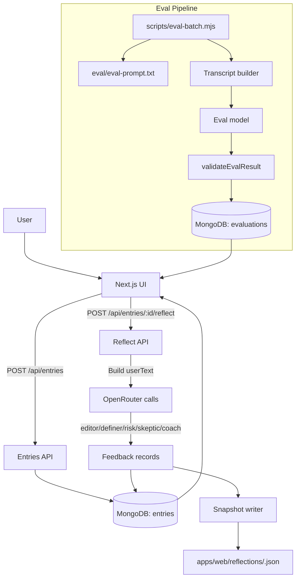

# System Documentation

## Purpose
This system lets a user write private entries, run multi-agent reflections, store feedback and snapshots, and evaluate output quality through an automated eval pipeline. It is designed to preserve user intent while enforcing strict formatting and role boundaries.

## Architecture Overview
- UI (Next.js App Router) for authoring entries and viewing reflections.
- API routes for entry CRUD and reflection orchestration.
- Multi-agent prompting with shared rules + agent-specific prompts.
- Persistence in MongoDB for entries, feedback, and eval results.
- Snapshot store on disk for auditability.
- Eval pipeline that validates format and role compliance.

## Data Model (High Level)
- `entries`: title, body, status, word count, timestamps.
- `feedback`: entryId, agent, content, model, promptVersion, timestamps.
- `evaluations`: entryId, promptVersion, verdict, score, agentEvals, timestamps.
- `reflections` snapshots: `apps/web/reflections/<entryId>.json`.

## Agent Roles
- `editor`: clarity and structure without changing meaning.
- `definer`: operational definitions and boundaries.
- `risk`: privacy/reputation/permanence risks.
- `skeptic`: stress-test the core claim.
- `coach`: options + single recommendation.

## End-to-End Workflow
1. User writes an entry and saves it.
2. Entry is stored in MongoDB (`entries`).
3. User triggers reflection.
4. API calls each agent with `SHARED_RULES + PROMPTS[agent]`.
5. Agent outputs are stored in `feedback` and entry status is updated.
6. A snapshot is written to `apps/web/reflections/<entryId>.json`.
7. Eval pipeline can be run to validate outputs and store eval results.

## Mermaid Diagram

## Key Components
- Prompts: `apps/web/lib/prompts.ts` (shared rules + agent prompts).
- Model config: `apps/web/lib/model-config.ts` (per-agent overrides).
- Reflection routes:
  - `apps/web/app/api/entries/[id]/reflect/route.ts`
  - `apps/web/app/api/entries/[id]/reflect/stream/route.ts`
- Eval utilities:
  - `apps/web/lib/eval-utils.ts`
  - `apps/web/lib/eval-utils.mjs`
- Eval prompt: `apps/web/eval/eval-prompt.txt`.
- Admin eval dashboard: `apps/web/app/admin/eval`.

## Configuration
- `.env.local` required values:
  - `MONGODB_URI`, `MONGODB_DB`
  - `OPENROUTER_API_KEY`
  - `OPENROUTER_MODEL` (fallback)
- Optional per-agent overrides:
  - `OPENROUTER_MODEL_EDITOR`
  - `OPENROUTER_MODEL_DEFINER`
  - `OPENROUTER_MODEL_RISK`
  - `OPENROUTER_MODEL_SKEPTIC`
  - `OPENROUTER_MODEL_COACH`
- Optional per-agent max tokens:
  - `OPENROUTER_MAX_TOKENS_EDITOR`
  - `OPENROUTER_MAX_TOKENS_DEFINER`
  - `OPENROUTER_MAX_TOKENS_RISK`
  - `OPENROUTER_MAX_TOKENS_SKEPTIC`
  - `OPENROUTER_MAX_TOKENS_COACH`

## Operational Commands
Run from `apps/web`:
- Dev server: `npm run dev`
- Lint: `npm run lint`
- Eval recent 5: `node scripts/eval-batch.mjs --mode=recent --limit=5`
- Eval PR gate: `npm run eval:pr`

## Sync Checklist (When Changing Agents)
- `apps/web/lib/prompts.ts` (prompt + version)
- Reflect routes agent list
- `apps/web/lib/model-config.ts`
- `apps/web/eval/eval-prompt.txt`
- `apps/web/lib/eval-utils.ts` and `.mjs`
- UI agent labels/order (`apps/web/app/page.tsx`)
- Eval dashboard (`apps/web/app/admin/eval`)
